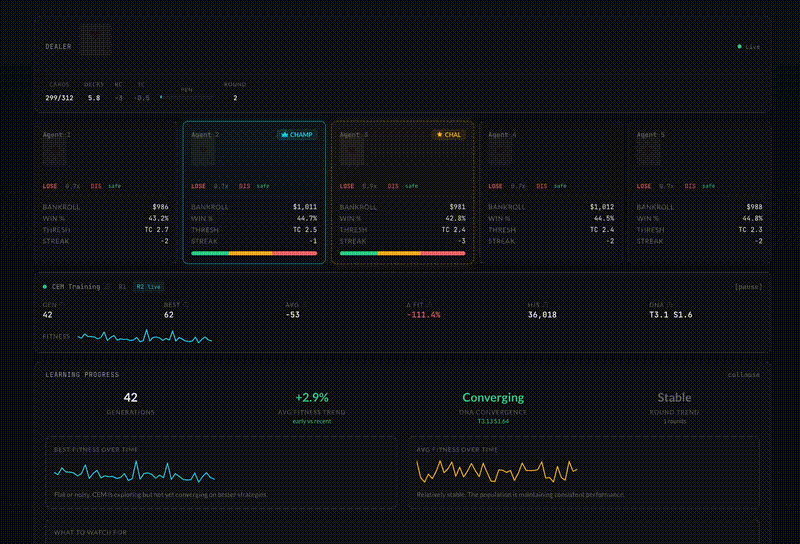

# Blackjack ML Agents

An interactive simulation of AI agents learning to play blackjack through evolutionary optimization.



## About

This project demonstrates machine learning, algorithmic thinking, and systems design through a live blackjack simulation. Five AI agents compete at a shared table, each evolving their own betting strategy over time using the Cross-Entropy Method. The simulation visualizes how agents learn to exploit card counting signals, manage risk based on their position, and adapt to changing conditions across rounds. Built as a technical showcase exploring the intersection of reinforcement learning concepts and interactive web development.

## How It Works

### Cross-Entropy Method

A population-based optimization algorithm that drives agent evolution:

1. Sample a population of strategies from a probability distribution
2. Simulate hundreds of blackjack hands per strategy
3. Rank strategies by total profit (fitness)
4. Select the top performers (elite fraction)
5. Update the distribution mean and variance toward the elites
6. Repeat

Over generations, the population converges on strategies that minimize losses against the house edge.

### Hi-Lo Card Counting

All agents share a persistent 6-deck shoe (312 cards):

| Card | Count Value |
|------|-------------|
| 2-6  | +1          |
| 7-9  | 0           |
| 10-A | -1          |

The running count is normalized by decks remaining to produce a **true count**. Each agent interprets the true count relative to their own DNA threshold. An agent with threshold 1.0 sees TC +1 as advantageous, while an agent with threshold 2.5 sees the same count as neutral. This creates diverse strategies competing at the same table.

### Strategy DNA

Each agent is defined by three parameters:

| Parameter | Description | Typical Range |
|-----------|-------------|---------------|
| **Threshold** | True count at which the agent starts betting big | TC +1 to +3 |
| **Slope** | How aggressively bets scale above the threshold | 0.5 to 2.0 per TC |
| **Max Spread** | Maximum bet multiplier | 4x to 12x |

### Position-Aware Risk

Agents adjust their betting based on three factors:

| Factor | Signal | Range |
|--------|--------|-------|
| Position | Bankroll vs leader | 0.7x (ahead) to 2.5x (behind) |
| Count | True count advantage/disadvantage | 0.6x to 1.5x |
| Momentum | Recent win/loss streak | 0.9x to 1.3x |

Combined risk factor is capped between 0.5x and 8x, consistent with real blackjack bet spreads.

### Rounds

The shoe reshuffles at 75% penetration, starting a new round. Bankrupt agents ($0 bankroll) are eliminated until the next round when all agents revive with fresh $1,000. EMA-smoothed bankroll carries across rounds so past performance influences future rankings.

## Features

- Live blackjack table with animated dealer and per-agent hands
- Per-agent card counting with individual threshold interpretation
- Champion/Challenger system with sustained-performance dethrone rule
- Hot streak detection (3+ consecutive profitable generations)
- Round history with clickable snapshots of past rounds
- Learning Progress dashboard showing fitness trends, DNA convergence, and round-over-round performance
- Interactive legend with hover tooltips explaining every metric
- Training runs in a Web Worker for smooth 60fps UI
- localStorage persistence to resume training across sessions

## Stack

| Layer | Technology |
|-------|-----------|
| Framework | React + TypeScript |
| Build | Vite |
| Styling | Tailwind CSS |
| Animation | Framer Motion |
| State | Zustand |
| Compute | Web Workers |
| Persistence | localStorage |

## Getting Started

```bash
npm install
npm run dev
```

## Build

```bash
npm run build
npm run preview
```

## Author

**Anthony Feliz**
[GitHub](https://github.com/arfgit) | [LinkedIn](https://linkedin.com/in/anthonyfeliz)
